# UDCTF 2023

I created 9 challenges for the CTF. Here are the problems and intended solutions for 2. I may get to the remaining 7 later. Enjoy :)

## 1 of 2: SIMP
This challenge takes a newbie through their first directory brute force, ssh private key theft, and privesc through exploiting a root cronjob (or Pwnkit), and a reverse shell.

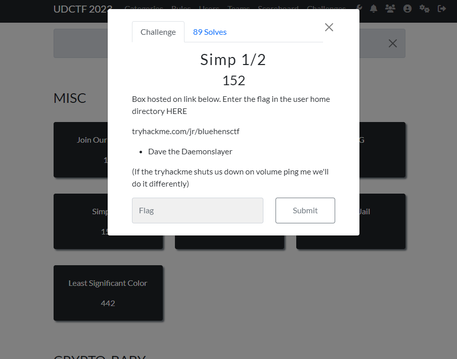

### Recon

(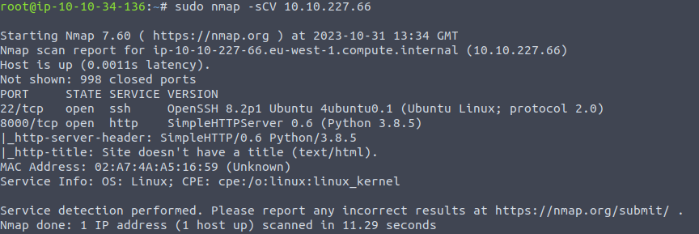

Notice two TCP ports, 22 and 8000. 8000 is an alternate http service so lets check it out. 

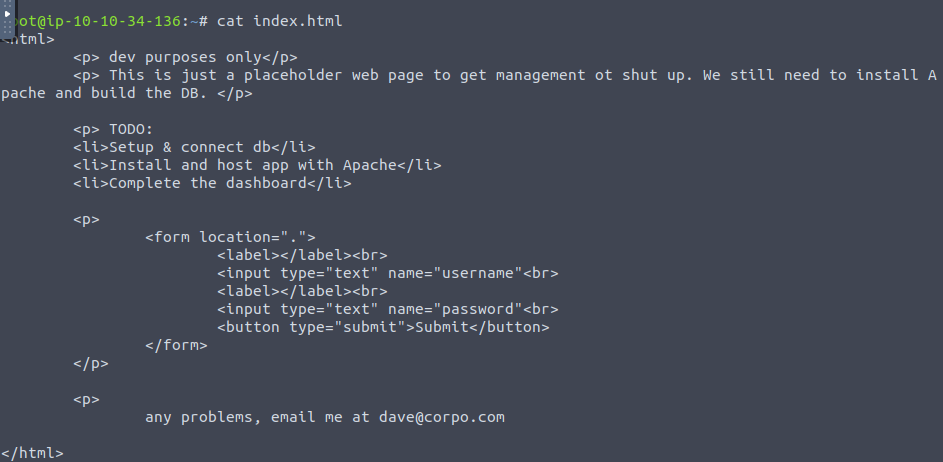
Its a webpage... but a placeholder webpage in development. Lets run dirbuster to se eif there's anything interesting in the serving directory.

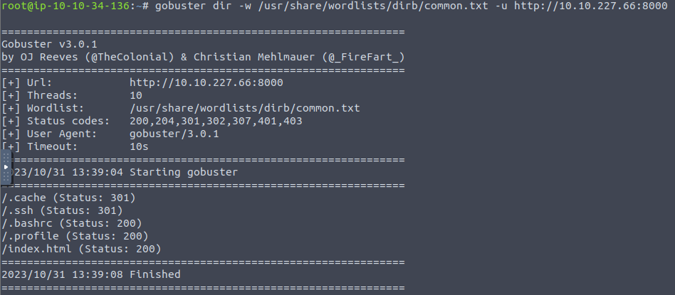
Big uh-oh on the devs part, see the `.ssh` directory is accessible (maybe)

### Initial Exploitaiton

Lets use that stolen private ssh key to log in to the web server. 

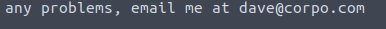
On the web page, the email `dave@corpo.com` was present. This may be the account for which the stolen key belongs to. 

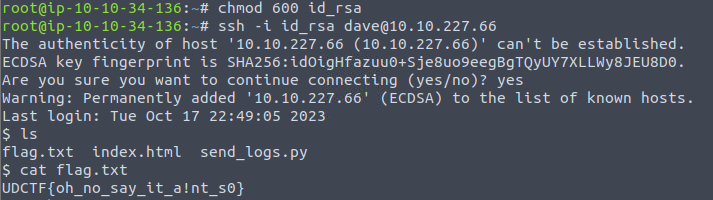
Bingo. There's our initial access.

## SIMP II (continuation of SIMP I)

### Privilege Escalation

Now we need to find a way to root.

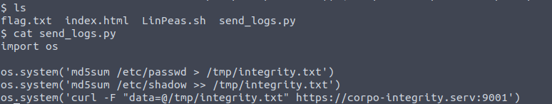
On the target machine in dave's home directory, we see a few files. One of which is `send_logs.py`

Notice the file computes the md5 file hash of `/etc/shadow`

ROOT is required to do so. THAT is interesting. AND...

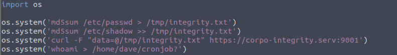

We're able to edit the `send_logs.py` file. So I want to add a line to the end to create a file called `'cronjob?'` with `whoami` echoed to the contents.

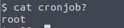

Add a reverse shell payload to the `send_logs.py` file:

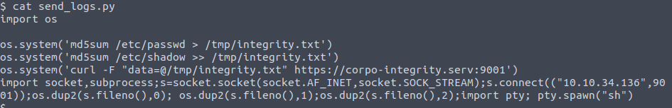

And we wait... 

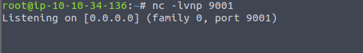

And there it is 

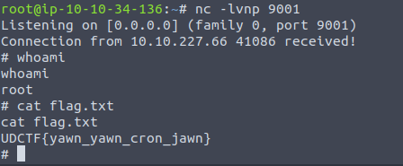

## 2 of 2: SQL 4 Dummies

An easy SQL injection. The challenge: break into rickjames account.  

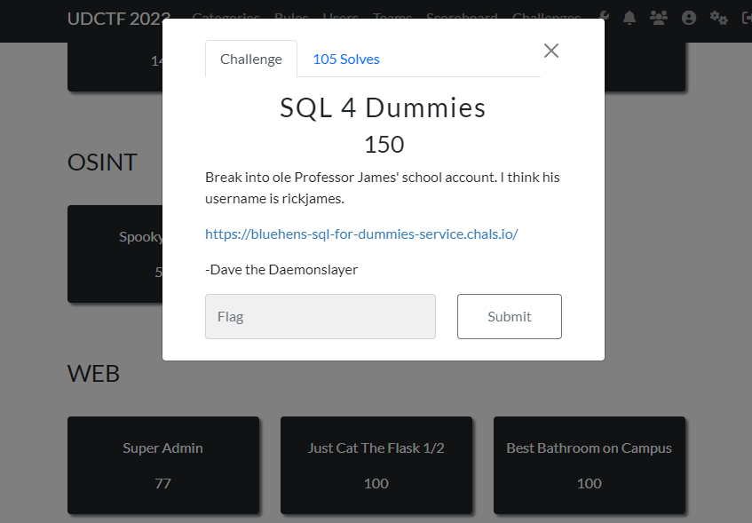

The authentication page:

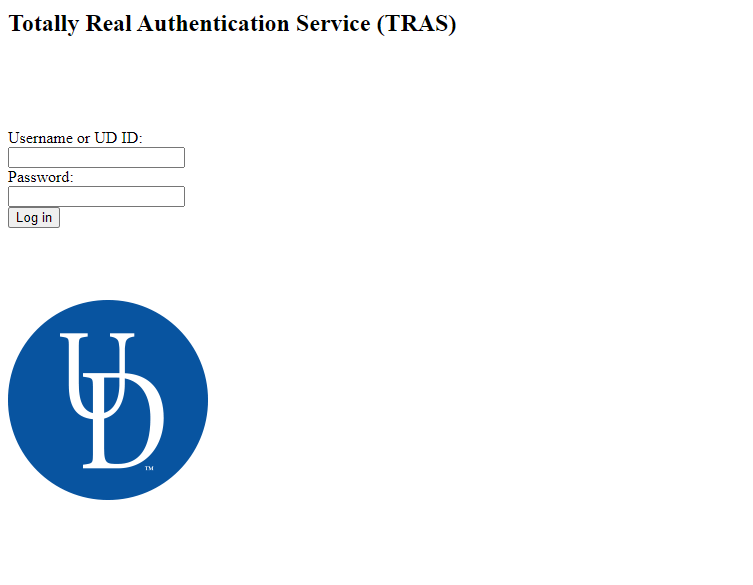

Enter some creds to see what happens.

The username is read back to us. 

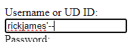

Try to end the sql variable with ' and negate the remaining query with a comment char -- 

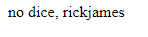

The input was filtered

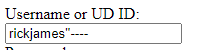

Try the same combo of chars inside the same combo of chars

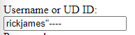

bingo!

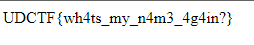
