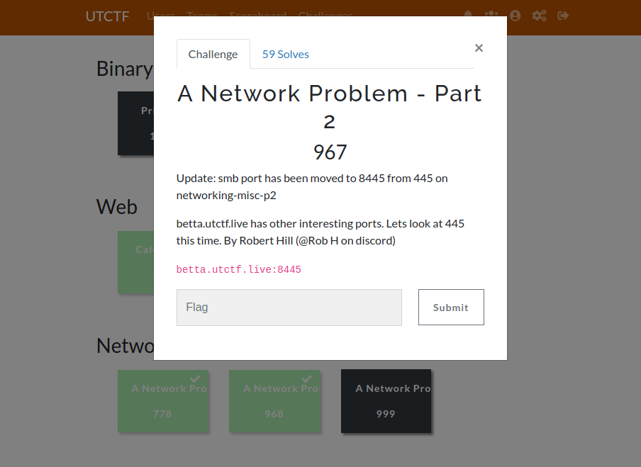
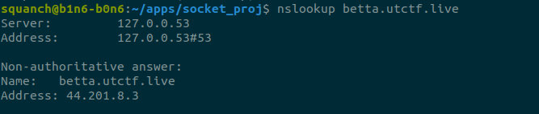
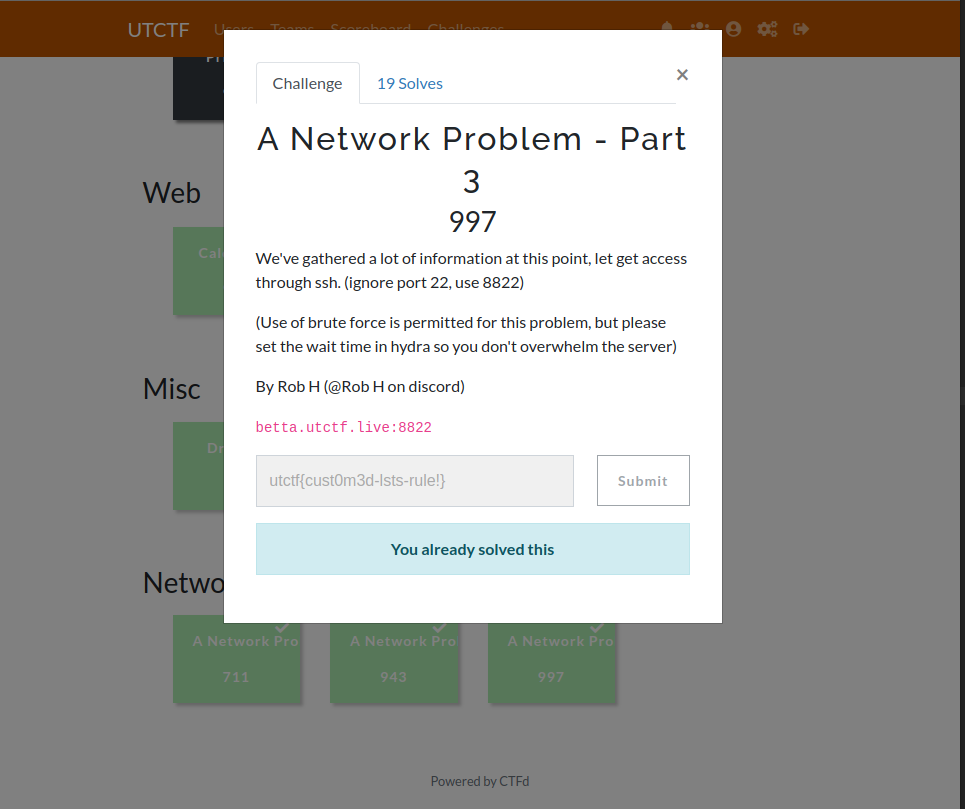
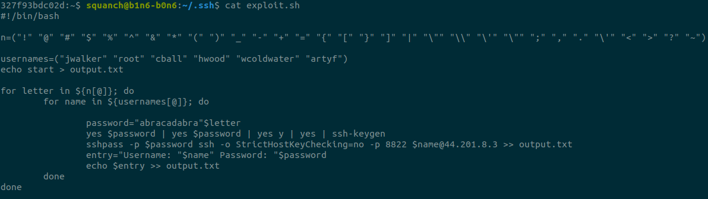
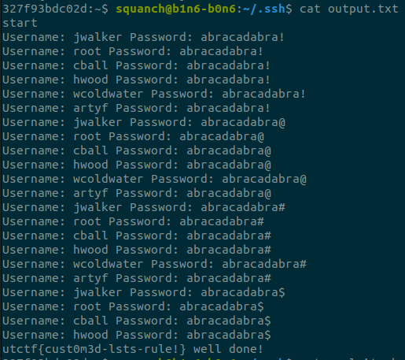

# UTCTF 2023

## Summary
An overall good set of challenges; I tried my hand at four but only solved two. I had much success at the network security problems. Even though I didn't finish the forensics, I learned alot. So that's good, I guess. The two solves are closely related so I will combine them into one writeup. 

## 1. SMB Infiltration



* Some background on 445:
Port 445 commonly operates Microsoft's Server Message Block (SMB) protocol. SMB gained infamy after it was exploited with EternalBlue in the devastating ransomeware attack, WannaCry. Read about WannaCry [CVE-2017-0144](https://nvd.nist.gov/vuln/detail/CVE-2017-0144)

After some infomation gathering on SMB, I found there is a smbclient package for Ubuntu. The software can be installed with the command:
```shell
sudo apt-get install smbclient
```

### Recon

To use smbclient, we need to know the IP address in addition to the hostname. We run the nslookup to find the IP address of the given domain name. 



So we know the IP of our target is 44.201.8.3. Now lets run a scan of open ports, just to see what ports the server is listening on.


Note the 445, that's SMB! 


After reviewing the smbclient manual, I notice the -L option can be used to scan for shares on a host. So,


### Infiltration

Lets connect to a share using smbclient.


We successfully connected to the Workshares directory. Now we can poke around and see what we find. 

### Exfiltration


Check out this note to IT. We cant open and view it here, but we can download it to our machine with 'mget'

Cool. 


Here's our first flag... Along with some interesting info in the note. 

Turns out Crystal Ball, Wade Coldwater Jay Walker, Holly Wood, and possibly Arty F all use "abracadabra" as their passwords. Arty F instructs them to append a special character to make it more secure. Sounds great Arty. 

This may come be handy in our next challenge.

## 2. SSH Brute Force



* Many servers are administered remotely using ssh, witch listens on port 22. ssh encrypts with a passphrase and, unless you know the passphrase, its totally secure. 

### Recon

Looking at our nmap scan, we can see ssh is open on our target. 


Note the information gathered infiltrating the server via SMB. A few users have used the password "abracadabra" and have been instructed to append it with a special character for security.

### Exploit Development

Crystal Ball, Wade Coldwater, Jay Walker, Holly Wood, and Arty F. are our target users. 

* Note* A buddy passed along some info gathered via OSINT: Usernames are first initial + last name. 

Target Users:              
* cball                 
* wcoldwater            
* jwalker               
* hwood                
* artyf                

Possible Passwords:
* abawcadabra@ 
* abacadabra# 
* abacadabra$ 
* ....and so on... 

We need generate an ssh key for each possible passphrase, for each user, and try to ssh into the target. After each attempt, we'll log the output.

Sounds like a job for a brute force bash script.



### Run the Exploit

Initiate the script. 

And here's the output. 



And there's the flag.