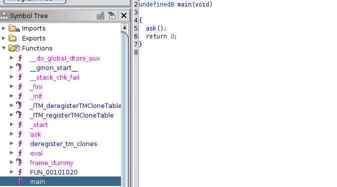
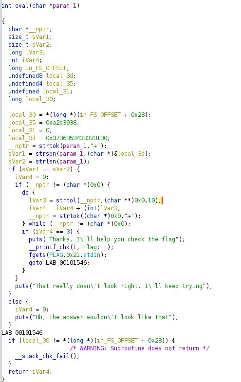
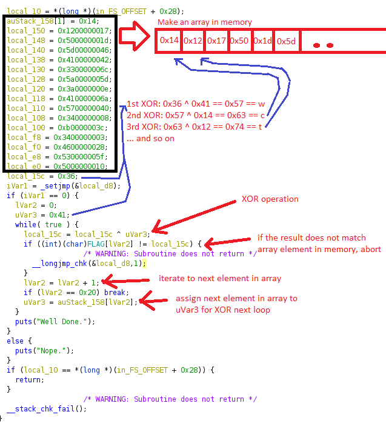
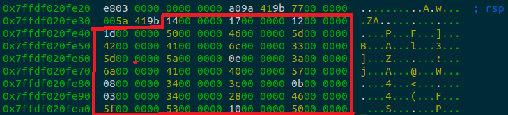
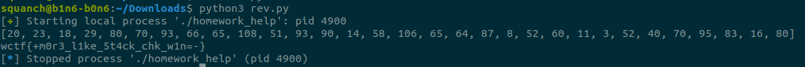

# UTCTF 2023

## Summary
A great set of challenges. I didn't have much time this weekend, so I tried my hand at one reverse engineer problem and successfully solved the problem.

## 1. Homework Help

* PICTURE HERE

### Examine the code

The challenge includes one binary file and is reminiscent of an old linscence key crack. Lets download and examine with Ghidra. 

* If you're not familiar with Ghidra, it's a sick NSA tool used to decompile binaries. [Check it out on Github](https://github.com/NationalSecurityAgency/ghidra)

Here's the decompiled code:

Main calls ask()...

Ask reads in an unlimited amount of input, then calls eval().

Eval checks the input, if '3' is entered, it asks us to guess the flag, reads in 0x21 bytes to the FLAG buffer, then return Is that all? Really? There needs to be more. Let's check __stack_chk_fail(), as that is the only uncalled function. In ask(), we can read in unlimited bytes, then we can overflow the buffer and trigger the stack check failure. The cool thing is, __stack_chk_fail will be called after eval(), so we will have already written to the flag buffer before triggering the failure. 

Perfect, this is where the magic happens; if you write to the flag buffer in eval() and trigger a buffer overflow in ask(), __stack_chk_fail will XOR our input against a series of values on the stack to tell us if our flag is correct.

* Note: we won't perform this overflow. We know the keys and we know the first XOR, 0x41 ^ 0x36, which resolves to 'w', that's all we need to calculate the flag. However, if you want to know how to perform the overflow, here's the code: 

'''python3
from pwn import *
# using pwntools

p=process('./homework_help')
payload =b'3\x00' + b'wwwwwwwwwwwwwwwwwwwwwwwwwww'

p.sendline(payload)
resp = p.recv() 
print(resp)

p.sendline(b'FLAG_GUESS_HERE')
resp = p.recv() 
print(resp)
'''

We must write a script to compute the first XOR, 0x41 ^ 0x36, which resolves to 'w', then XOR the result with the first element of the artificial list, then XOR that result with the second element, ... and so on....

Which will look like:
* 0x41 ^ 0x36  == result1
* result1 ^ next arr[i] == result2
* result2 ^ next arr[i+1] == result3
* result3 ^ next arr[i+2] == result4
* and so on...

* 0x41 ^ 0x36 == 0x57 == 'w'
* 0x57 ^ 0x14 == 0x63 == 'c'
* 0x63 ^ 0x17 == 0x74 == 't'
* 0x74 ^ 0x12 == 0x66 == 'f'
* and so on...

Now that we have a picture of what is happening, let's run it through the [Radare2 (r2)](https://github.com/radareorg/radare2) debugger check out the list of XOR keys in memory. 

Here is the artificial XOR key list in memory; these values are what the program suspects will be the result of continued chain of XORs against the input charaters. 
 

Lets make a list of the keys so we can build a script to perform the XOR chain.

'''python3
bytes_of_interest = [0x14,0x17,0x12,0x1d,0x50,0x46,0x5d,0x42,0x41,0x6c,0x33,0x5d,0x5a,0x0e,0x3a,0x6a,0x41,0x40,0x57,0x08,0x34,0x3c,0x0b,0x03,0x34,0x28,0x46,0x5f,0x53,0x10,0x50]
'''

We can write a python3 script to solve:

'''python
bytes_of_interest = [0x14,0x17,0x12,0x1d,0x50,0x46,0x5d,0x42,0x41,0x6c,0x33,0x5d,0x5a,0x0e,0x3a,0x6a,0x41,0x40,0x57,0x08,0x34,0x3c,0x0b,0x03,0x34,0x28,0x46,0x5f,0x53,0x10,0x50]
print(bytes_of_interest)

result = 0x36^0x41
flag = ""
flag += chr(result)

for i in range(0,len(bytes_of_interest)):
    result = result ^ bytes_of_interest[i]
    flag+=chr(result)
    
print(flag)
'''

Beautiful,

