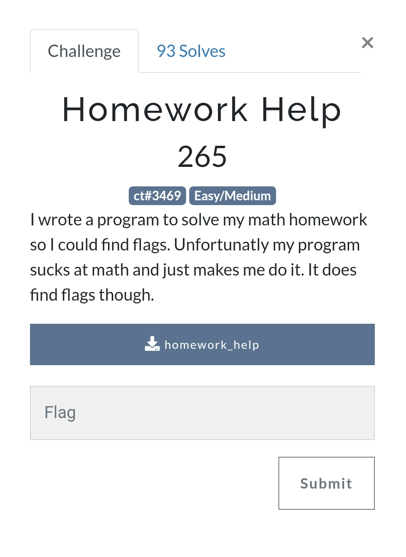
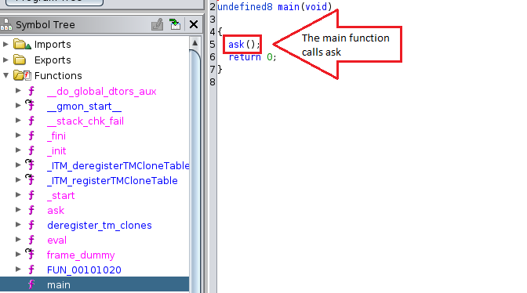
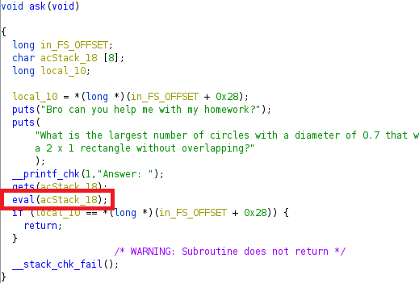
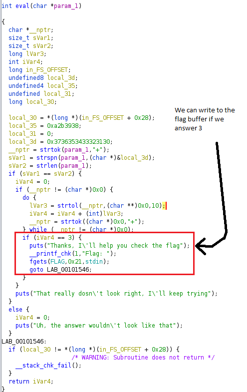

# UTCTF 2023

## Summary
A great set of challenges. I didn't have much time this weekend, but I tried my hand at one reverse engineering problem and successfully solved it.

* [homework_help](./homework_help)
* [overflow.py](./overflow.py)
* [solve.py](./solve.py)

## 1. Homework Help



### Examine the code

The challenge includes one binary file and is reminiscent of an old license key crack. Let's download the [homework_help](./homework_help) binary and examine with Ghidra. 

* If you're not familiar with Ghidra, it's a sick NSA tool used to decompile binaries. [Check it out on Github](https://github.com/NationalSecurityAgency/ghidra)

Here's the decompiled main function:



Main calls ask()...



Ask reads in UNLIMITED input, then calls eval().



Eval checks our input. If it reads '3', it'll then ask us to guess the flag, reading in 0x21 bytes to the FLAG buffer. Is that all? Really? There needs to be more! Let's check __stack_chk_fail(), as that is the only uncalled function. Remember, in ask(), we can enter UNLIMITED bytes! So, we can overflow the buffer and trigger the stack check failure. If we do this, __stack_chk_fail() triggers after eval(), so we will have already written to the flag buffer before triggering the failure. 


Perfect, this is where the magic happens; if you write to the flag buffer in eval() and trigger a stack check failure in ask(), __stack_chk_fail() will XOR our input against a series of XOR keys on the stack to tell us if our flag is correct.

* Note: we won't do this. We know the keys and we know the first XOR, 0x41 ^ 0x36, which resolves to 'w', that's all we need to calculate the flag. However, if you want to know how to perform the overflow, here's the code: 

```python
from pwn import *
# using pwntools

p=process('./homework_help')
payload =b'3\x00' + b'wwwwwwwwwwwwwwwwwwwwwwwwwww'

p.sendline(payload)
resp = p.recv() 
print(resp)

p.sendline(b'FLAG_GUESS_HERE')
resp = p.recv() 
print(resp)
```

### Build a solution

Now that we have a picture of what is happening, let's run the [homework_help](./homework_help) binary through [Radare2](https://github.com/radareorg/radare2) (r2) debugger check out the list of XOR keys in memory. 

Here is the XOR key list in memory; these values are what the program suspects will be the result of continued chain of XORs against the input charaters. 
 


Lets make a list of the keys so we can build a script to perform the XOR chain.

```python
xor_keys = [0x14,0x17,0x12,0x1d,0x50,0x46,0x5d,0x42,0x41,0x6c,0x33,0x5d,0x5a,0x0e,0x3a,0x6a,0x41,0x40,0x57,0x08,0x34,0x3c,0x0b,0x03,0x34,0x28,0x46,0x5f,0x53,0x10,0x50]
```

We must write a script to compute the first XOR, 0x41 ^ 0x36, which resolves to 'w', then XOR the result with the first element of the xor_keys array, then XOR that result with the second element, ... and so on....

Which will look like:
* 0x41 ^ 0x36  == result1 ('w')
* result1 ^ next xor_keys[i] == result2 ('c')
* result2 ^ next xor_keys[i+1] == result3 ('t')
* result3 ^ next xor_keys[i+2] == result4 ('f')
* and so on...

We can write a python3 script to compute the flag:

```python
xor_keys = [0x14,0x17,0x12,0x1d,0x50,0x46,0x5d,0x42,0x41,0x6c,0x33,0x5d,0x5a,0x0e,0x3a,0x6a,0x41,0x40,0x57,0x08,0x34,0x3c,0x0b,0x03,0x34,0x28,0x46,0x5f,0x53,0x10,0x50]
print(xor_keys)

result = 0x36^0x41
flag = ""
flag += chr(result)

for i in range(0,len(xor_keys)):
    result = result ^ xor_keys[i]
    flag+=chr(result)
    
print(flag)
```

Beautiful,


